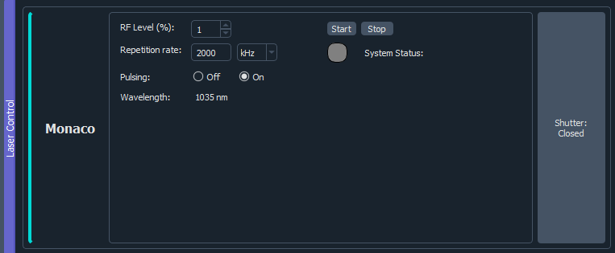

# Juffmann ImSwitch User Guide 
This documentation guide aims to explain how to use imswitch at the Juffmann Laboratories. <br>
It is assumed that ImSwitch is already installed on your device. For installation and development guidelines please refer to the Juffmann ImSwitch Development Guide. 
+   [Section 0: Configuration JSON files](#0-configuration-json-files) <br> This section covers the 
    JSON setup files that contain the specific configuration of devices in the current experiment. 
    Since JSON does not allow comments, this section explains which parameters are mandatory for specific devices
    and covers the units of certain parameters.  

+   [Section 1: Monaco Laser](#1-monaco-laser-) <br>
    1.1:  Operating requirements <br>
    1.2: GUI explanation ⚠️🥽 **WARNING: Laser Safety Rules!** 🥽⚠️ <br>
    1.3: Important files 
+   [Section 2: Photometrics BSI Prime](#2-photometrics-bsi-prime) <br>
    2.1: Operating requirements <br>
    2.2: Additional package installation 💻🚫 <br>
    2.3: Important files
    
## 0. Configuration JSON files

Imswitch configuration files are found under `Documents/ImSwitchConfig/imcontrol_setups`. <br>
To load the wanted configuration pass the filename in the `setupFileName` parameter in `Documents/ImSwitchConfig/config/imcontrol_options.json`. <br>

To add a device to your configuration you need to add it in the JSON setup file.
The out-of-the-box ImSwitch implementation supports the following devices: 
+ `detectors`
+ `lasers`
+ `positioners`

All devices consist of general properties and device specific properties. When adding a device in the configuration file, use the following tables for the correct properties. 

**General Device Properties**

| Property              | Required | JSON type           | Explanation                                                                                                                                                                                                                                                                               |
|-----------------------|----------|---------------------|-------------------------------------------------------------------------------------------------------------------------------------------------------------------------------------------------------------------------------------------------------------------------------------------|
| `analogChannel`       | No       | string              | Channel for analog communication. ``null`` if the device is digital or doesn't use NI-DAQ. If an integer is specified, it will be translated to Dev1/ao{analogChannel}                                                                                                                    |
| `digitalLine`         | No       | int                 | Line for digital communication. ``null`` if the device is analog or doesn't use NI-DAQ. If an integer is specified, it will be translated to Dev1/port0/line{digitalLine}                                                                                                                 | 
| `managerName`         | Yes      | string              | Manager Class name                                                                                                                                                                                                                                                                        |
| ⚠️`managerProperties` | Yes      | (nested) dictionary | ⚠️ Custom properties to be passed to the manager. <br/> Example: Device -> Laser -> Monaco<br/> Device and Laser properties are covered by ImSwitch already but Monaco properties should be passed here. The are defined in [1.3 Configuration properties.](#13-configuration-properties) | 

**Detector Properties**

| Property            | Required | JSON type           | Explanation                                               |
|---------------------|----------|---------------------|-----------------------------------------------------------|
| `forAcquisition`    | Yes      | bool                | True if detector is used for acquisition of images/frames |
| `forFocusLock`      | Yes      | bool                | True if detector is used for the FocusLock                |  

**Laser Properties**

| Property         | Required | JSON type    | Explanation                                                                        |
|------------------|----------|--------------|------------------------------------------------------------------------------------|
| `valueRangeMin`  | No       | int or float | Minimum power value of the laser. ``null`` if laser doesn't allow setting a value  |
| `valueRangeMax`  | No       | int or float | Maximum power value of the laser. ``null`` if laser doesn't allow setting a value. |  
| `color`          | No       | int or float | Wavelength in nm for display colorbar of the laser in the GUI.                     |
| `freqRangeMin`   | No       | int          | Minimum value of frequency modulation. Don't fill if laser doesn't support it      |  
| `freqRangeMax`   | No       | int          | Maximum value of frequency modulation. Don't fill if laser doesn't support it      |
| `freqRangeInit`  | No       | int          | Initial value of frequency modulation. Don't fill if laser doesn't support it.     |  
| `valueRangeStep` | No       | int          | The default step size of the value range that the laser can be set to.             |

**Positioner Properties**

| Property              | Required | JSON type      | Explanation                                                            |
|-----------------------|----------|----------------|------------------------------------------------------------------------|
| `axes`                | Yes      | List (strings) | A list of axes (names) that the positioner controls, e.g. : ["X", "Y"] |
| `isPositiveDirection` | No       | bool           | Whether the direction of the positioner is positive.                   |  
| `forPositioning`      | No       | bool           | Whether the positioner is used for manual positioning.                 |
| `forScanning`         | No       | bool           | Whether the positioner is used for scanning.                           |        

## 1. Monaco Laser

### 1.1 Operating Requirements
To operate Monaco via imswitch the PC running imswitch needs to be in the same local network (192.168.0.X)
as communication is done via Telnet (over ethernet). The connection is opened and closed with each separate interaction. 
### 1.2 GUI Explanation ⚠️🥽 **WARNING: Laser Safety Rules!** 🥽⚠️
The GUI takes inspiration from the Coherent GUI. <br>
Adjusting the RF Level, repetition rate and toggling pulsing is available. <br>
To heat up the laser for operation, press Start. When pressed, the System Status will update and the Start button will display the text "Check". Click "Check" to receive updates until the System Status is "On" before operating. <br>
⚠️ The shutter is **immediately opened** when the shutter button is clicked! ⚠️ <br>
🥽 **WEAR SAFETY GOGGLES AND TURN ON THE LASER LIGHT!** 🥽



### 1.3 Configuration Properties

| Property       | Required | JSON type                       | Explanation                                                        |
|----------------|----------|---------------------------------|--------------------------------------------------------------------|
| `wavelength`   | Yes      | List [dict{"min": x, "max": y}] | Monaco operates at x=y=1035nm.                                     |
| `pulsing`      | Yes      | bool                            | True if pulsing needs to be on at startup. (Can be changed later)  |  
| `repRate`      | Yes      | int                             | Desired repetition rate at startup, in kHz. (Can be changed later) |


## 2. Photometrics BSI Prime
There exists a Python wrapper to enable communication with the BSI Prime camera, found on: https://github.com/Photometrics/PyVCAM. 
This is a custom Python package and cannot be installed via pip directly. Custom packages are found in the "vendor" folder. 
In the terminal from the main imswitch directory run the following to install: 

```
cd vendor/PyVCAM-master
python -m pip install .
```
Don't forget the "." (dot) at the end. From GitHub it requires Python version 3.9, the imswitch version of the pyvcam `pyproject.toml` file
is altered to allow version 3.8 as well. So far no bugs. 
### TODO / REMINDERS

+ Despeckle off
+ fan speed high, otherwise liquid cooled
+ serial number of Moment Mono: A21A635004
+ serial number of BSI Prime: A20D204005